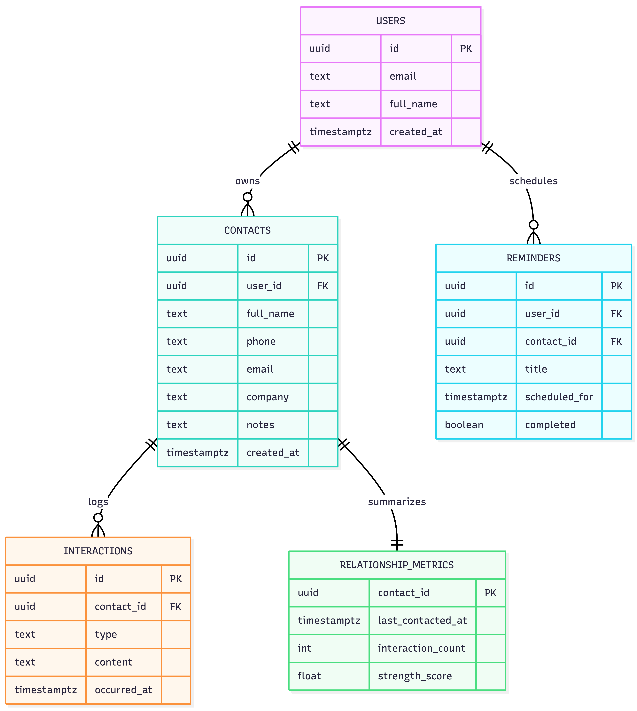

# Will use this to ask questions ask I go?

### 1. Trying to figure out the right orgnaizal structure for the api as it grows.

> I see a few...
>
> Domain first ?
>
> ```
> src/
> ├── domain/
> │   ├── user/
> │   │   ├── routes.rs
> │   │   ├── service.rs
> │   │   ├── repository.rs
> │   │   └── entity.rs
> │   │
> │   ├── order/
> │   │   ├── routes.rs
> │   │   ├── service.rs
> │   │   └── repository.rs
> │
> ├── db/
> ├── state.rs
> ├── app.rs
> └── main.rs
> ```
>
> classic service repo?
>
> ```
> src/
> └── models/
>     ├── order.rs
>     └── user.rs
> └── repositories/
>     ├── order.rs
>     └── user.rs
> └── router/
>     ├── order.rs
>     └── user.rs
> └── services/
>     ├── order.rs
>     └── user.rs
> ├── db/
> ├── state.rs
> ├── app.rs
> └── main.rs
> ```

Great question. I think your choice, and either can work well as long as its consistent. I think I've tended towards grouping functional things together for a few reasons.

- When you group by domain, you get into ambiguity when domains inevitabely overlap, intersect, and each is just not like the rest in some way. The functional structures are explicit and unambiguious because they are concretely about where they fit into the _stucture of your system_, not about where they best fit in the _user needs you're trying to service_.
- When you have domain's they can become dumping grounds for all the things. Assuming you have `src/domains/order/helpers.rs`, do you expect to find functions that are able to be used by both the respository and the service and the routes? That feels risky, right? So you end up with `helpers.routs.rs`, `helpers.entity.rs` etc? What if the file is less categorically named and more specifically named? `descendants.rs` for example. 3 companies I've worked for (and I expect with project management Stoke will soon become the 4th) have had a file or folder called descendants that was a core piece of the system. In the domain model where does it fit? The answer is probably nowhere? Everywhere maybe? In a service model the answer is clear: Descendants is a service of it's own, even if it there is neither a descendants route nor a respository and it spans nearly every core domain, which is ok beccause it's simply a service calling into other services when it's asked to join their luggage onto it's descendants (hierarchy) query.
- Systems are arguably easier to reason about when adjacent things are "similar". Similar role, similar depth into the system topology, etc. Grouping services together fits this exactly, grouping a router next to a repository is antithetical.

### 2. Is there a good book I can read about database modeling? 
In this schema I feel like the reminders is lacking. I think my reminders is missing a ton of things I will need to track the schema. I guess I can just put more thought into it. 

Reminders for a contact. We need a frequency. But what's the correct way to track that? Days and just make it an i32 and do the conversion on the frontend? And times? 

What are the questions I can ask to nail down the requirements more. 

I guess I want daily, weekly, monthly and quarterly reachouts from a set date. But also the times that these are scheduled should matter? 
